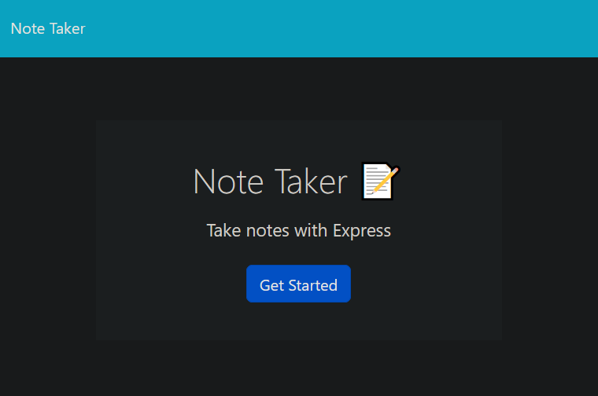

# Note-Taker

## Description

This application is a note-taker that can store notes created by the user. The server was created to read and write user input to a json file.

## Installation

Run the command ```npm i``` in the terminal.

## Usage

Run ```npm start``` in terminal to run the app locally.

Explore the deployed application at https://mysterious-sierra-40745.herokuapp.com/



## License

N/A